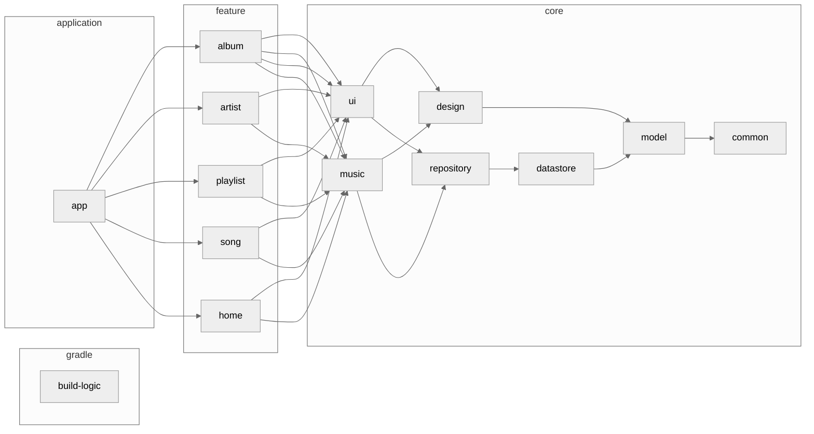

<h1 align="center">Kanade</h1>

Kanadeでワクワクドキドキな音楽体験を！ 
Kanadeは同期歌詞を表示できるエレガントな音楽プレイヤーアプリです。

  
  
  
  

    

## Status
#### WIP :construction:

まだ開発途中です！できている機能やこれから実装すべき機能は下のセクションを見てください。完成予定日時はまだわかりませんが、年内（2023）には完成させる予定です！コントリビュートはいつでも歓迎です。下のセクションに従ってアプリをビルドしてみてください。

## Why?

自分の腕試しのために作りました！言うなればポートフォリオですね。`Android` `Kotlin` `Jetpack Compose` の知識を深め、自分の能力を知ってもらいたかったんです。他には、既存の音楽プレイヤーアプリはローカルに保存されている音楽の歌詞を表示できないのが不満でした。Spotifyとかサブスクの音楽は歌詞を表示できるのにね。

## Tech Stack

- <a href="https://kotlinlang.org/">Kotlin</a>
- <a href="https://kotlinlang.org/docs/coroutines-overview.html">Kotlin Coroutines</a>
- <a href="https://kotlinlang.org/docs/flow.html">Kotlin Flow<a>
- <a href="https://developer.android.com/jetpack/compose?hl=ja">Jetpack Compose</a>
- <a href="https://m3.material.io/">Material3</a>

## Feature
#### Ready!!

- 音楽再生機能
  - Media3を用いた再生
  - MediaStoreからの読み込み / 書き込み
  - MediaStyle Notification
  - Equalizer
  - 同期歌詞の編集 / 表示
  - プレイリストの作成
- 音楽情報取得
  - <a href="last.fm">Last.fm API</a>
  - <a href="https://www.musixmatch.com">Musixmatch API</a>
  - <a href="https://www.spotify.com">Spotify API</a>

#### Not Ready...

- 音楽の早送り / 巻き戻し（秒単位）
- イコライザープリセット機能
- 同期歌詞の作成（WALKMANみたいな）
- MediaStore からのプレイリスト読み出し / 書き出し
- 音楽おすすめ機能
- アーティストおすすめ機能
- 課金系全般
- 広告系全般

## Architecture
アプリのアーキテクチャ図を示します。 だいぶ複雑になっているので、一部のモジュールや依存関係は省略し、概略を掴める形にしています。

## Contribute

このアプリは Gradle の Convention Plugins を用いてビルドのロジックを共通化しており、`build-logic` というモジュールに全てのロジックが記述されています。このアプローチに関しては、[nowinandroid](https://github.com/matsumo0922/nowinandroid/tree/main/build-logic) をご覧ください。

何か不具合を発見したり機能を改善したい場合、機能を新たに開発したい場合は、まず issue を書いてください。その上であなた自身を assign し、開発に取り組んでください。pull request はいつでも歓迎です :smile:

<a href="last.fm">Last.fm API</a> や <a href="https://www.musixmatch.com">Musixmatch API</a> を使用する場合は `local.properties` にAPIキーを追加してください。デフォルトでは空文字が入っています。詳細は `app/build.gradle.kts` を読んでください。 
