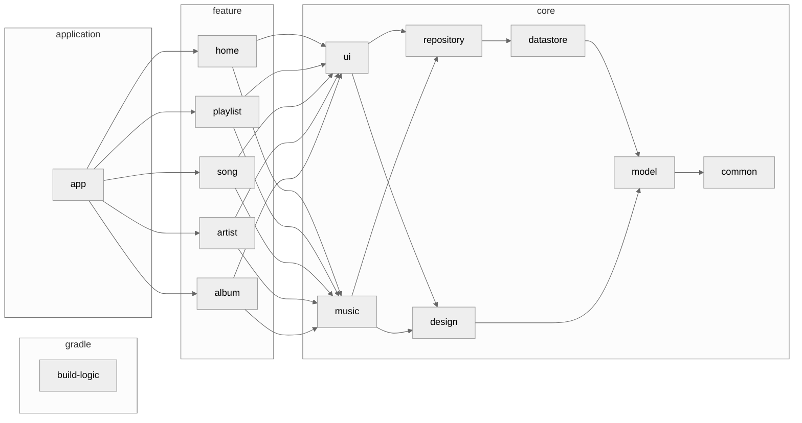

<h1 align="center">Kanade</h1>

<p align="center">
Kanadeでワクワクドキドキな音楽体験を！<br>
Kanadeは同期歌詞を表示できるエレガントな音楽プレイヤーアプリです。
</p>

<div align="center">
  <a href="./LICENSE">
    
  </a>
  <a href="">
    
  </a>
  <a href="https://github.com/matsumo0922/KanadeMark3/actions/workflows/pull-request-ci.yml/badge.svg">
    
  </a>
  <a href="https://open.vscode.dev/matsumo0922/KanadeMark3">
    
  </a>
</div>

<hr>

<p align="center">
    
</p>


## Status
#### WIP :construction:

まだ開発途中です！できている機能やこれから実装すべき機能は下のセクションを見てください。完成予定日時はまだわかりませんが、年内（2023）には完成させる予定です！コントリビュートはいつでも歓迎です。下のセクションに従ってアプリをビルドしてみてください。

## Why?

自分の腕試しのために作りました！言うなればポートフォリオですね。`Android` `Kotlin` `Jetpack Compose` の知識を深め、自分の能力を知ってもらいたかったんです。他には、既存の音楽プレイヤーアプリはローカルに保存されている音楽の歌詞を表示できないのが不満でした。Spotifyとかサブスクの音楽は歌詞を表示できるのにね。

## Tech Stack

- <a href="https://kotlinlang.org/">Kotlin</a>
- <a href="https://kotlinlang.org/docs/coroutines-overview.html">Kotlin Coroutines</a>
- <a href="https://kotlinlang.org/docs/flow.html">Kotlin Flow<a>
- <a href="https://developer.android.com/jetpack/compose?hl=ja">Jetpack Compose</a>
- <a href="https://m3.material.io/">Material3</a>

## Feature
#### Ready!!

- 音楽再生機能
  - Media3を用いた再生
  - MediaStoreからの読み込み / 書き込み
  - MediaStyle Notification
  - Equalizer
  - 同期歌詞の編集 / 表示
  - プレイリストの作成
- 音楽情報取得
  - <a href="last.fm">Last.fm API</a>
  - <a href="https://www.musixmatch.com">Musixmatch API</a>
  - <a href="https://www.spotify.com">Spotify API</a>

#### Not Ready...

- 音楽の早送り / 巻き戻し（秒単位）
- イコライザープリセット機能
- 同期歌詞の作成（WALKMANみたいな）
- MediaStore からのプレイリスト読み出し / 書き出し
- 音楽おすすめ機能
- アーティストおすすめ機能
- 課金系全般
- 広告系全般

## Architecture
アプリのアーキテクチャ図を示します。 だいぶ複雑になっているので、一部のモジュールや依存関係は省略し、概略を掴める形にしています。


## Contribute

このアプリは Gradle の Convention Plugins を用いてビルドのロジックを共通化しており、`build-logic` というモジュールに全てのロジックが記述されています。このアプローチに関しては、[nowinandroid](https://github.com/matsumo0922/nowinandroid/tree/main/build-logic) をご覧ください。

何か不具合を発見したり機能を改善したい場合、機能を新たに開発したい場合は、まず issue を書いてください。その上であなた自身を assign し、開発に取り組んでください。pull request はいつでも歓迎です :smile:

<a href="last.fm">Last.fm API</a> や <a href="https://www.musixmatch.com">Musixmatch API</a> を使用する場合は `local.properties` にAPIキーを追加してください。デフォルトでは空文字が入っています。詳細は `app/build.gradle.kts` を読んでください。 

## License

```text
Kanade
Copyright (C) 2023 daichi-matsumoto

This program is free software: you can redistribute it and/or modify
it under the terms of the GNU General Public License as published by
the Free Software Foundation, either version 3 of the License, or
(at your option) any later version.

This program is distributed in the hope that it will be useful,
but WITHOUT ANY WARRANTY; without even the implied warranty of
MERCHANTABILITY or FITNESS FOR A PARTICULAR PURPOSE.  See the
GNU General Public License for more details.

You should have received a copy of the GNU General Public License
along with this program.  If not, see <https://www.gnu.org/licenses/>.

Also you can contact me by electronic mail at caios.system@gmail.com.

If the program does terminal interaction, make it output a short
notice like this when it starts in an interactive mode:

    Kanade  Copyright (C) 2023 daichi-matsumoto
    This program comes with ABSOLUTELY NO WARRANTY; for details type `show w'.
    This is free software, and you are welcome to redistribute it
    under certain conditions; type `show c' for details.

The hypothetical commands `show w' and `show c' should show the appropriate
parts of the General Public License.  Of course, your program's commands
might be different; for a GUI interface, you would use an "about box".

You should also get your employer (if you work as a programmer) or school,
if any, to sign a "copyright disclaimer" for the program, if necessary.
For more information on this, and how to apply and follow the GNU GPL, see
<https://www.gnu.org/licenses/>.

The GNU General Public License does not permit incorporating your program
into proprietary programs.  If your program is a subroutine library, you
may consider it more useful to permit linking proprietary applications with
the library.  If this is what you want to do, use the GNU Lesser General
Public License instead of this License.  But first, please read
<https://www.gnu.org/licenses/why-not-lgpl.html>.
```
