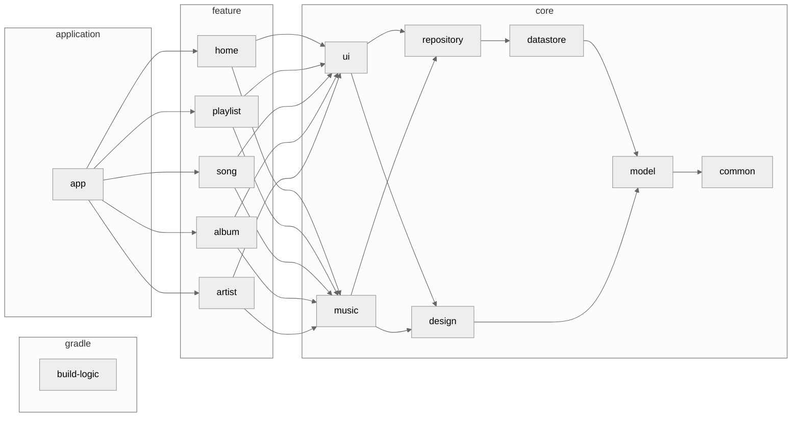

<h1 align="center">Kanade</h1>

<p align="center">
Experience the thrill and excitement of music with Kanade!<br>
Kanade is an elegant music player app that can display synchronized lyrics.
</p>

<div align="center">
  <a href="./LICENSE">
    
  </a>
  <a href="">
    
  </a>
  <a href="https://github.com/matsumo0922/KanadeMark3/actions/workflows/pull-request-ci.yml/badge.svg">
    
  </a>
  <a href="https://open.vscode.dev/matsumo0922/KanadeMark3">
    
  </a>
</div>

<hr>

<p align="center">
    
</p>

<p align="center">Do you speak Japanese? Japanese <a href="./README-ja.md">READEME</a> is Here!</p>

## Status
#### Ready!! :rocket:

After a long development period, we have finally released it to Google Play!
However, development is still ongoing and contributions are always welcome. Try building your app by following the section below.

#### [Download](https://play.google.com/store/apps/details?id=caios.android.kanade) from GooglePlay

## Why?

I created this as a test of my own skills! It's like a portfolio. I wanted to deepen my knowledge of `Android`, `Kotlin`, and `Jetpack Compose`, and let people know about my capabilities. In addition, I was unsatisfied that existing music player apps could not display lyrics for music stored locally. Even subscription music services like Spotify can display lyrics.

## Tech Stack

- <a href="https://kotlinlang.org/">Kotlin</a>
- <a href="https://kotlinlang.org/docs/coroutines-overview.html">Kotlin Coroutines</a>
- <a href="https://kotlinlang.org/docs/flow.html">Kotlin Flow<a>
- <a href="https://developer.android.com/jetpack/compose?hl=ja">Jetpack Compose</a>
- <a href="https://developer.android.com/jetpack/compose/glance">Jetpack Glance</a>
- <a href="https://m3.material.io/">Material3</a>

## Feature
#### Ready!!

- Music playback function
  - Playback using Media3
  - Reading / Writing from MediaStore
  - MediaStyle Notification
  - Equalizer
  - Editing / Display of synchronized lyrics
  - Playlist creation
  - Home Widget
- Music information retrieval
  - <a href="last.fm">Last.fm API</a>
  - <a href="https://www.musixmatch.com">Musixmatch API</a>
  - <a href="https://www.spotify.com">Spotify API</a>

#### Not Ready...

- Fast forward / Rewind music (in seconds)
- Music recommendation function
- Artist recommendation function
- Overall advertising system

## Architecture
This shows the architecture diagram of the app. It has become quite complex, so some modules and dependencies are omitted to give an overview.


## Contribute

This app uses Gradle's Convention Plugins to standardize the build logic, and all logic is described in a module called `build-logic`. For more information about this approach, please visit [nowinandroid](https://github.com/matsumo0922/nowinandroid/tree/main/build-logic).

If you find any bugs or want to improve a feature, or want to develop a new feature, please write an issue first. Then assign yourself and get to work on development. Pull requests are always welcome :smile:

When using the <a href="last.fm">Last.fm API</a> or <a href="https://www.musixmatch.com">Musixmatch API</a>, please add the API key to `local.properties`. By default, it is an empty string. For details, please read `app/build.gradle.kts`.

## License

```text
Kanade
Copyright (C) 2023 daichi-matsumoto

This program is free software: you can redistribute it and/or modify
it under the terms of the GNU General Public License as published by
the Free Software Foundation, either version 3 of the License, or
(at your option) any later version.

This program is distributed in the hope that it will be useful,
but WITHOUT ANY WARRANTY; without even the implied warranty of
MERCHANTABILITY or FITNESS FOR A PARTICULAR PURPOSE.  See the
GNU General Public License for more details.

You should have received a copy of the GNU General Public License
along with this program.  If not, see <https://www.gnu.org/licenses/>.

Also you can contact me by electronic mail at caios.system@gmail.com.

If the program does terminal interaction, make it output a short
notice like this when it starts in an interactive mode:

    Kanade  Copyright (C) 2023 daichi-matsumoto
    This program comes with ABSOLUTELY NO WARRANTY; for details type `show w'.
    This is free software, and you are welcome to redistribute it
    under certain conditions; type `show c' for details.

The hypothetical commands `show w' and `show c' should show the appropriate
parts of the General Public License.  Of course, your program's commands
might be different; for a GUI interface, you would use an "about box".

You should also get your employer (if you work as a programmer) or school,
if any, to sign a "copyright disclaimer" for the program, if necessary.
For more information on this, and how to apply and follow the GNU GPL, see
<https://www.gnu.org/licenses/>.

The GNU General Public License does not permit incorporating your program
into proprietary programs.  If your program is a subroutine library, you
may consider it more useful to permit linking proprietary applications with
the library.  If this is what you want to do, use the GNU Lesser General
Public License instead of this License.  But first, please read
<https://www.gnu.org/licenses/why-not-lgpl.html>.
```
